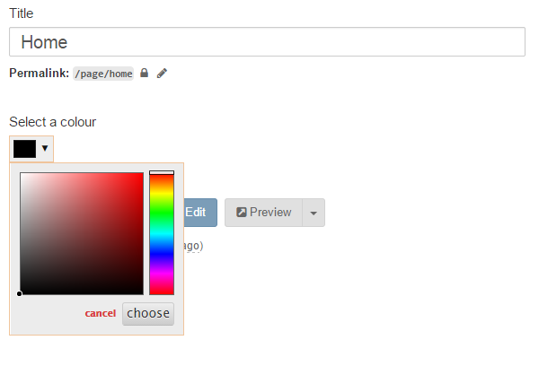
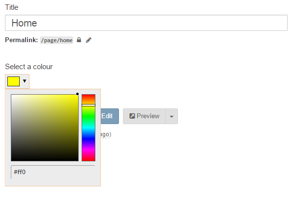
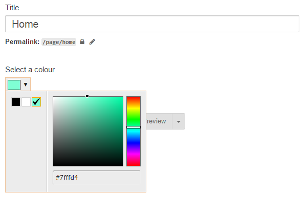
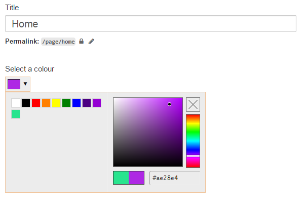

# ColourSpectrum Extension for Bolt CMS

Adds an advanced (eyedropper, presets etc.) colourpicker field type powered by [Spectrum](http://bgrins.github.io/spectrum/)



## Usage

contenttypes.yml:
```
color:
    type: colourspectrum
```

## Options and Examples

All [Spectrum options](https://bgrins.github.io/spectrum/#options) are available via an options key in your content type config:
```
color:
    type: colourspectrum
    options:
        color: "yellow"
        showInput: true
        showButtons: false
```


```
color:
    label: "Select a colour"
    type: colourspectrum
    options:
        showInput: true
        showButtons: false
        showPalette: true
        palette: [ ['black', 'white', 'aquamarine'] ]
```


```
color:
    label: "Select a colour"
    type: colourspectrum
    options:
        showInput: true
        showButtons: false
        showInitial: true
        showPalette: true
        allowEmpty: true
```

